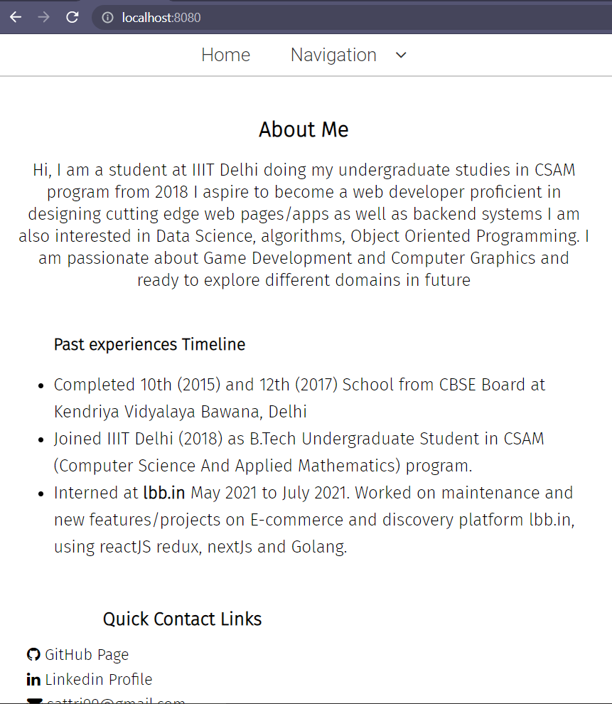

+++
title = "Website design v0"
date = 2021-08-21
[extra]
author = "Sudhir Attri"
twitter = "attrism"
github = "sudhirattri"
youtube = "watch?v=28FVxYQuLOQ"
+++

## Why Does this website looks plain. . . for now atleast

Usually, when we decide to do something outside the domain of responsibility, there is always a fear of losing motivation midway or losing valuable time to pursue perfection. Especially for something that will go public for your friends and colleagues to see, the fear or anxiety can delay the work or even dismiss the project altogether.

So, I have decided to be brave and push this raw version of the website as a start. I call this v0 : nothing is final; everything is a placeholder for now.

<!-- more -->

I am using 11ty to build this static site and decided to use 0% css libraries, and I will remain true to it in the final versions as well. Some of the CSS classes stil have non standard naming as I have used the base templates from years ago when I was still learning.

In the v0 version, I have focused on minimalism and clarity, but I soon realzed that as soon as I add an image or a card like element or a table (for post listing page), it becomes difficult to fit it into single color scheme with no grpahical patterns or efffects. In my next attempt, viz. v1, I will add more gradients, shadows and colors to allow addition of images and tables.

Here is the picture of what this website looks like now. These pictures will help me compare the progress gradually. I hope I don't lose motivation to update these pages in the future, as people have told me now.

  
  
V0 mobile

<!--  -->

  
  
V0 desktop

